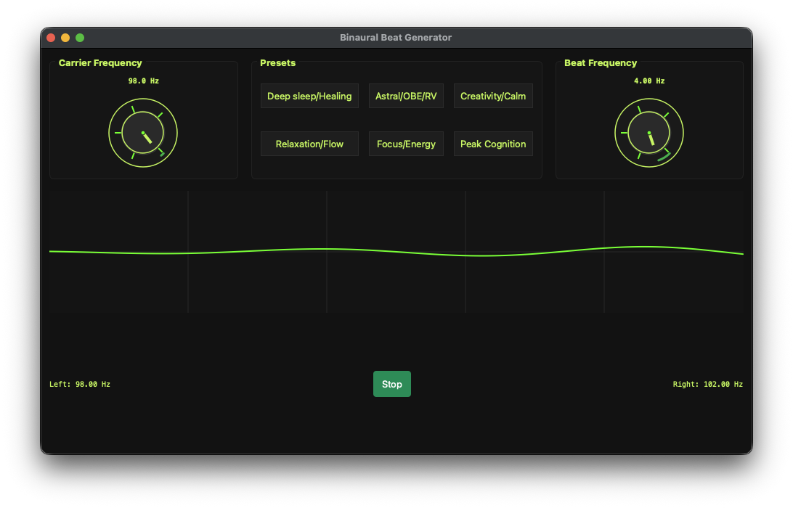

# bbeat.py – Pure Binaural Beat Generator


*Two dials. Live oscilloscope. Pure sine tones. Nothing else.*

A **minimalist, real-time binaural beat generator** written in **Python** using **PyQt6** and **PyAudio**.
Designed for **macOS (M4 compatible)** — runs on any modern Python 3.9+ system.

---

## Features

- **Two dials**:
  - **Carrier Frequency** (50–2000 Hz)
  - **Beat Frequency** (0.1–40.0 Hz)
- **Live oscilloscope** — visual proof the signal is active
- **6 built-in presets**
- **Mouse wheel control** (1 Hz / 0.1 Hz steps)
- **Smooth ramp-in/out** to avoid pops
- **Zero noise, zero ads, zero bloat**

> **No claims of healing, astral projection, or brain rewiring.**
> Just clean, controllable binaural tones.

---

## Requirements

```bash
pip install numpy PyQt6 sounddevice
```

---

## Run It

```bash
python3 bbeat.py
```

That’s it.

---

## Presets

| Name                | Beat (Hz) | Brainwave Band |
|---------------------|-----------|----------------|
| Deep sleep/Healing  | 2.5       | Delta          |
| Astral/OBE/RV       | 4.0       | Theta          |
| Creativity/Calm     | 7.0       | Theta          |
| Relaxation/Flow     | 10.0      | Alpha          |
| Focus/Energy        | 16.0      | Beta           |
| Peak Cognition      | 40.0      | Gamma          |

---

## Why This Exists

- Tired of bloated apps with 10-minute intros
- Wanted **instant control** over carrier and beat
- Needed **visual feedback** that audio is live
- Built in one evening. Works.

## For the Curious

The **CIA declassified "Analysis and Assessment of Gateway Process"** (1983) explores binaural beats for altered states.

[Read the PDF (29 pages)](https://www.cia.gov/readingroom/docs/CIA-RDP96-00788R001700210016-5.pdf)

> *No endorsement. Just history.*

---

## License

**MIT** — do whatever you want with it.
